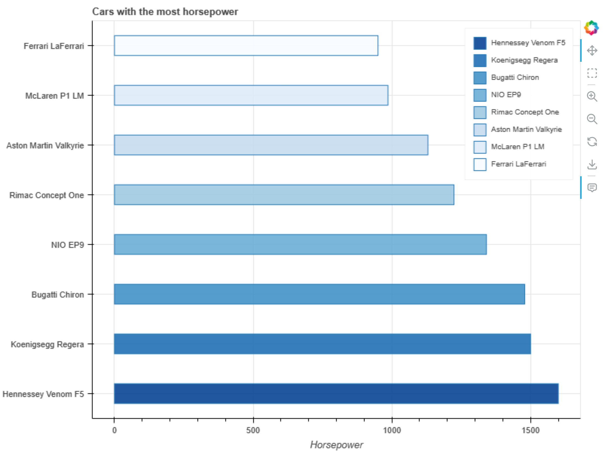

# Python Bokeh Chart

>Chart/visualization of the top horsepower cars. Created using Python and the Bokeh library. 



## Quick Start

```bash
# Install dependencies
pipenv install

# Generate html
python main.py
```